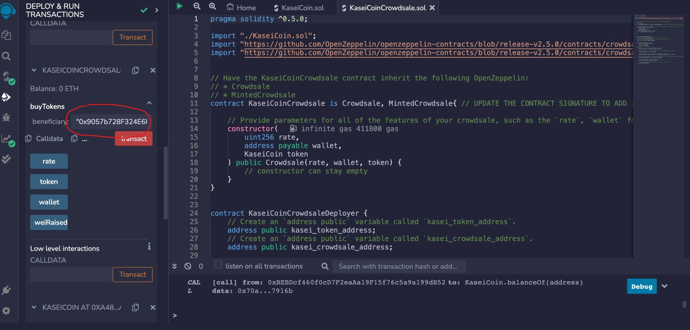

 

# Challenge: Martian Token Crowdsale

create a fungible token that is ERC-20 compliant and that will be minted by using a `Crowdsale` contract from the OpenZeppelin Solidity library.

The crowdsale contract will 
- manage the entire crowdsale process, allowing users to send ether to the contract and in return receive KAI, or KaseiCoin tokens. 
- mint the tokens automatically and distribute them to buyers in one transaction.

## Evaluation Evidence

The steps for this Challenge are divided into the following sections:

1. Compile the KaseiCoin Token Contract

2. Compile the KaseiCoin Crowdsale Contract

3. Compile the KaseiCoin Deployer Contract

4. Deploy the crowdsale to a local blockchain with Remix, MetaMask, and Ganache.

5. Test the functionality of the crowdsale by using test accounts to buy new tokens and then checking the balances associated with those accounts.

6. After purchasing tokens with one or more test accounts, view the total supply of minted tokens and the amount of wei that has been raised in the crowdsale contract.

 

 